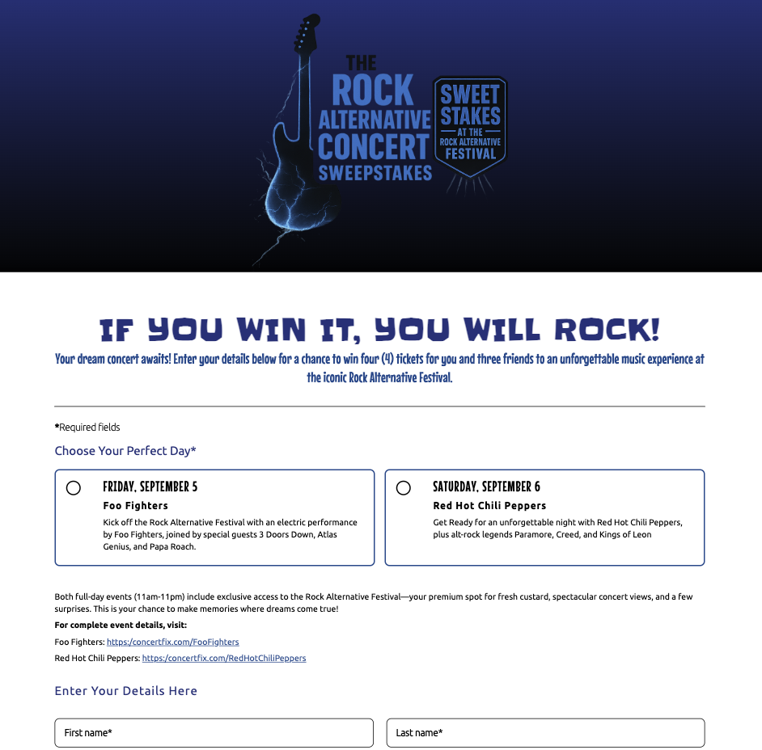

# Sweepstakes site

  

## Overview

A simple web application that provides a user-friendly form for entering sweepstakes, with client-side validation and responsive design.

### Features

- Submit personal details (name, email, etc.) through a clean, accessible form.
- Client-side validation for required fields and email format.
- Display success or error messages based on form input.
- Responsive design optimized for desktop and mobile devices.
- Smooth hover states for interactive elements like buttons.
- Accessible form inputs with clear error messaging.

### Technologies

- HTML5: Structure of the web page.
- CSS3: Styling with a custom stylesheet (styles.css).
- JavaScript: Client-side logic for form validation and submission handling (script.js).
- Netlify: Hosting the static site.

## Demo

Try the live app at [here](https://rockaltsweeps.netlify.app/). Add, edit, delete, and filter tasks with smooth animations.

## Getting Started

### Prerequisites

- A modern web browser for testing.
- Node.js and npm installed for local development (optional, if using a build process).

### Installation

#### 1. Clone the repository:

- git clone https://github.com/vanessacl/sweepstakes-form-js.git

#### 2. Navigate to the project directory:

- cd sweepstakes-form-js

#### Install dependencies (if running locally):

- npm install

#### 3. Compile Sass:

- Ensure Sass compiles scss/index.scss (or your Sass file) to css/index.css:

#### 4. Serve the application:

- Use a local server (e.g., VS Code Live Server) or open index.html in a browser.

## Deployment

- Deploy the project to Netlify by connecting your GitHub repository.
- The app will be live at the Netlify-provided URL (e.g., https://rockaltsweeps.netlify.app).

## Usage

1. Open the app in a web browser.
2. Fill out the form fields (e.g., name, email).
3. Click the submit button to validate the input.
4. View success or error messages based on the input provided.

## File Structure

- index.html: Main HTML structure.
- css/index.css: Custom styles.
- js/utils.js: Client-side JavaScript for form validation and submission.

## Contributing

Feel free to submit issues or pull requests on the GitHub repository.

## Acknowledgments

- Netlify for hosting the static site.
- The open-source community for providing valuable resources and inspiration.

## License

This project is licensed under the MIT License.
